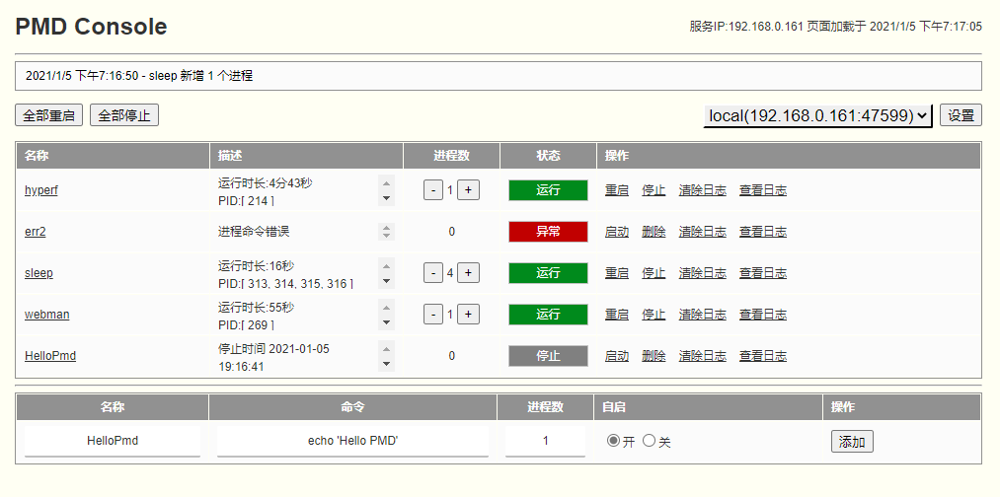

# PMD

基于 ReactPHP 进程管理工具，适合管理常驻服务。

## 安装

务必全局安装使用，并将 `composer bin` 目录添加到 PATH 环境变量中

```bash
composer global require php-pmd/pmd
```
## Usage
启动
```bash
pmd start
```
重启
```bash
pmd restart
```
停止
```bash
pmd stop
```
查看本地 Process 配置 ( 供Http服务设置 ) 
```bash
pmd process
```
设置Http服务访问用户名、密码、端口
```bash
pmd start -u user -p 123456 --port 2021 | pmd start --user user --pass 123456 --port 2021
```
帮助
```bash
pmd -h | pmd --help
```
版本
```bash
pmd -v | pmd --version
```

HTTP 管理面板



提供远程进程 新增、删除、重启、停止、删除、查看日志、清空日志等...


设置远程 PMD 服务，通过`pmd process`查看服务配置信息
